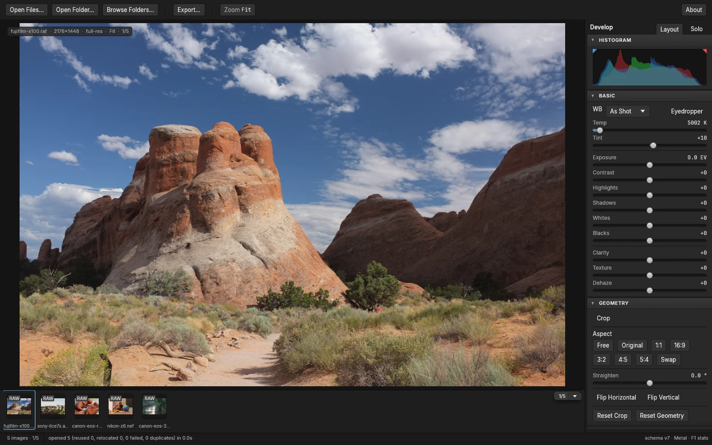

# Lightbox

An open-source, local-first raw photo editor.

Lightbox is editing-first: colour correction, tone, curves, grading and geometry, applied non-destructively to raw and rendered images. Local adjustments, retouch and on-device AI are intended and are not built yet. There is no library and no catalogue of your photos. You drag a file, a folder, or a multi-file selection onto the window, or open one from the OS dialog or the command line, and you land straight in the editor with a filmstrip of whatever you opened. Close the app and that session is gone; reopen the same file later and your edit comes back, because it was never stored in a library, it was stored against the file's content hash. This is a deliberate cut, not a missing feature: earlier plans for Lightbox included a Lightroom-style catalogue, collections, keywords, and culling, and all of that was removed from scope in favour of depth in colour and editing.

## Installing it

Download the latest `Lightbox.dmg` from the [releases page](https://github.com/thepixelabs/lightbox/releases/latest), open it, and drag Lightbox to Applications. Apple Silicon, macOS 11 and later. The raw decoder is inside the app, so there is nothing else to install.

The first time you open it, macOS will almost certainly say Lightbox is damaged. It is not. Lightbox is not signed with an Apple Developer ID yet, and that is how macOS words its refusal to open an unsigned download. Run this once:

```sh
xattr -dr com.apple.quarantine /Applications/Lightbox.app
```

Every release publishes a `SHA256SUMS` file if you would rather verify the download first. Building from source is covered under [Building it](#building-it) below.

`lightbox-cli`, the headless half of Lightbox, ships inside the app at `/Applications/Lightbox.app/Contents/MacOS/lightbox-cli`. Symlink it onto your `PATH` if you want it there. It is also the only place full sensor decoding is wired up today, for the reasons set out below.

## Status

Lightbox is pre-1.0 and under active development. The foundation (workspace, crash-safe edit store, render engine, editor shell, edit history and presets) is built and exercised end to end, including a kill-9 crash-safety drill. The global develop toolset is landing panel by panel. Masking, retouch, and local AI are not built. Treat everything below as a snapshot, not a promise; nothing here is aspirational, but a fast-moving project drifts, so if you rely on something specific, check the code.

## What works today

- Opening photos: drag-and-drop of a single file, a multi-file selection, a folder, or a folder tree (recursive), the OS open dialog, command-line arguments, and a live folder explorer for browsing into nested folders. Every path lands in one editor with a session filmstrip; none of them build or persist a library index.
- A GPU compute node-graph render engine (wgpu, written in WGSL) that shares one device with the UI for zero-copy display, with a CPU fallback path so editing keeps working, at preview resolution, if the GPU is unavailable or lost.
- A develop rail covering white balance, exposure and tone, presence (clarity, texture, dehaze), a parametric and point tone curve, an 8-band HSL colour mixer, three-way colour grading, and basic crop and straighten geometry. Panels dock, collapse, and rearrange, and remember how you left them.
- Non-destructive editing throughout: every change is a versioned, undoable recipe, not baked pixels, stored in a local SQLite edit store keyed by content hash rather than by file path. History, named snapshots, and a survives-`kill -9` guarantee are all real and tested against real crashes, not just claimed.
- A curated built-in preset library, plus saving, applying, importing, and exporting your own presets, and a picker for installing third-party creative LUT packs (`.cube`, HaldCLUT).
- Optional XMP sidecar read and write, mapped onto Adobe's `crs:` fields where one exists and a separate `lb:` namespace for what that schema doesn't cover. The edit store is always the source of truth; the sidecar is a projection you opt into.
- Cancellable background jobs, so importing, previewing, and rendering never block the UI thread.
- Batch export to JPEG, PNG, or TIFF, from the shell's export dialog or from a headless CLI (`lightbox-cli`) that also drives store creation, folder browsing, editing, XMP status, backup, and integrity checks with no dependency on the UI at all.

## What is not built yet

- Sensor-data editing **in the editor**. The decoder is built and ships inside the app, and only `lightbox-cli` calls it today; the editor grades the JPEG your camera embedded in the raw file, and its canvas badge says so. See [Raw decoding, LibRaw, and what the editor actually shows you](#raw-decoding-libraw-and-what-the-editor-actually-shows-you) for how to measure the difference yourself.
- Masking, local adjustments, and retouch (heal, clone, remove). `lightbox-mask` exists in the workspace only as an empty crate reserving the name.
- Any local AI: denoise, super-resolution, AI-assisted masking, and the out-of-process ONNX inference host. `lightbox-ml` is likewise an empty reserved crate.
- AI Looks, the image-adaptive cinematic grading engine described in the project's own planning documents as a core feature, is specced but its build status could not be confirmed from those documents at the time of writing. Do not assume it works.
- The clean-room demosaic algorithm and the rest of the "complete raw parameter surface" goal: highlight reconstruction from raw latitude, per-channel camera calibration, raw-domain denoise, and lens/geometry correction beyond crop and straighten.
- The rest of export: watermarking, an external-editor round trip, JPEG XL/AVIF/DNG output, filename templates, collision handling, and export presets.
- XMP/Lightroom interop hardening beyond the basic sidecar read/write above.
- Any library, catalogue, or index of your photos: no persistent database of images, no collections, no keywords, no ratings, no cross-shoot search. This is cut on purpose, not pending.

## Platforms, honestly

macOS on Apple Silicon is the only platform anyone has actually edited a photograph on. Every performance measurement, every crash-safety drill, and every hour of real use behind this repository happened there.

| Platform | State |
|---|---|
| macOS (Apple Silicon) | The development and release target. Verified by hand and by drill |
| macOS (Intel) | Should work, never built or run. No release artefact is produced for it |
| Linux | Compiles and passes the full test suite on every commit, under a software Vulkan adapter (Mesa lavapipe). Nobody has opened a photo on it |
| Windows | Compiles and passes the full test suite on every commit, under DX12 WARP. Nobody has opened a photo on it |

CI running green on Linux and Windows means the code compiles and the tests pass on a headless runner with a software GPU. It does not mean the editor is usable there, that the window behaves, that colour is right on a real display, or that performance is acceptable. Treat both as untested rather than supported.

**We would genuinely like to hear from you if you run Lightbox on Linux or Windows.** Whether it worked, where it fell over, what your GPU is, and what the window did. Open an issue and say so, even briefly. That is the only way either platform moves from "compiles" to "supported", and there is nobody here with the hardware to do it alone.

## Screenshots



## Building it

Lightbox is a Rust workspace. The toolchain is pinned in `rust-toolchain.toml`; any `cargo`/`rustup` invocation in the repo picks up 1.96.1 with `rustfmt` and `clippy` automatically. If `cargo` isn't already on your `PATH`:

```sh
export PATH="$HOME/.cargo/bin:$PATH"
```

Fetch the pinned test-fixture corpus once (a small, hash-verified set of CC0 raw files used by the test suite):

```sh
cargo xtask fixtures
```

Then the five gates that every commit here has to pass, in the order CI runs them:

```sh
cargo build --workspace
cargo test --workspace
cargo clippy --workspace --all-targets -- -D warnings
cargo fmt --all --check
cargo deny check
```

Run the editor:

```sh
cargo run -p lightbox-shell
```

`cargo run -p lightbox-shell -- --smoke 60` is a self-test, not the app: it boots the shell headlessly and exits after about a second. That exit is by design, not a crash; it exists so CI can prove the shell still boots on three platforms without a human watching a window.

On macOS, package a real app bundle:

```sh
cargo xtask bundle-mac --with-libraw            # target/macos/Lightbox.app
cargo xtask bundle-mac --with-libraw --install  # and copy it into /Applications
cargo xtask bundle-mac --with-libraw --dmg      # and a distributable disk image
```

`--with-libraw` needs LibRaw on the build machine (`brew install libraw`) and is what makes the bundle self-contained; the next section explains why it matters and what it does not fix.

### Raw decoding, LibRaw, and what the editor actually shows you

Two separate things live under this heading and they are easy to conflate.

**How raw decoding is built.** Turning sensor data into an image goes through [LibRaw](https://www.libraw.org/), which we take under its LGPL-2.1 option. To keep copyleft code out of Lightbox's own process, LibRaw is never linked into the editor. It runs in a separate process, `lightbox-rawproxy`, dynamically linked, behind a cargo feature:

```sh
cargo build -p lightbox-rawproxy --features libraw
```

The separation is not only a licence matter. Raw files in the wild are truncated, corrupt, or from cameras nobody tested, and LibRaw can crash on them. Because the decoder is its own process, a crash kills the proxy, the parent notices, restarts it, and reports that one file as bad instead of taking your session down.

**How to get a build that has it.** Release builds bundle everything:

```sh
brew install libraw
cargo xtask bundle-mac --with-libraw --install
```

That builds the proxy with the feature on, places it beside the editor inside `Lightbox.app` (which is where `ProxyConfig::autodetect` looks for it), vendors LibRaw and its dependent libraries into `Contents/Frameworks` with `@rpath` install names, ships LibRaw's licence text under `Contents/Resources/licenses/`, and verifies with `otool -L` that no binary in the bundle reaches for anything outside it. Without `--with-libraw` you get a bundle with no decoder in it, which is fine for development and is not a shipping configuration. The downloadable release is always built with it.

**What the editor shows you today, which is the part people get wrong.** Shipping the decoder is necessary and it is not sufficient. `decode_for_develop`, the function that produces sensor-derived pixels, currently has exactly one caller in the workspace: `lightbox-cli`. The editor does not call it. `lightbox-shell` does not depend on `lightbox-decode` at all; its pixels come through `lightbox-preview`'s `EmbeddedPreviewProvider`, which decodes the finished JPEG your camera embedded in the raw file. The canvas tier badge says `embedded preview` for exactly this reason.

You can measure it on any raw file:

```sh
lightbox-cli open photo.raf --store /tmp/s.lbdata      # the editor's entry path
lightbox-cli render --catalog /tmp/s.lbdata --image 1 --out editor.png
lightbox-cli render-ref --file photo.raf --out sensor.png
```

On the Fujifilm fixture in this repository the first writes 2176x1448, the preview's size, and the second writes 4310x2870, the sensor's.

So: **full sensor decoding is built, shipped, and reachable through `lightbox-cli`. The editor grades the embedded preview.** Wiring the shell's source provider to the proxy is the next substantial piece of work and it belongs with the E10/E11 develop epics, alongside a raw-only extension to the recipe schema. Until then, pushing white balance or highlight recovery in the editor is operating on eight-bit rendered pixels, not on latitude that is still there.

## Repository layout

| Path | Contents |
|---|---|
| `crates/` | The Rust workspace: engine, edit store, decode, colour, shell, CLI, and the reserved-but-empty masking/ML crates |
| `tools/` | `xtask` (the task runner used above) and the golden-image/perf/profile-generation tools that support it |
| `assets/` | Bundled, licence-tracked content: colour profiles/looks and the built-in preset library |
| `fixtures/` | The hash-pinned CC0 test corpus fetched by `cargo xtask fixtures` |
| `web/` | The project website |

See [`ARCHITECTURE.md`](ARCHITECTURE.md) for how the pieces fit together and why, and [`CONTRIBUTING.md`](CONTRIBUTING.md) for how to get a change in.

## Licensing

Lightbox is free software, published under the GNU Affero General Public
License, version 3 or, at your option, any later version, with an attribution
requirement added under section 7(b) of that licence and set out in
COPYING.additional-terms. In practice that term means anything built on
Lightbox and given to other people has to credit it, in its about box or
wherever it credits the rest of the software it is built from.

If you are a photographer, that licence asks nothing of you. Use Lightbox for
personal work, for study, and for paid client work. Modify it if you like.
Running the software, modified or not, creates no obligation of any kind.

The licence matters if you intend to build Lightbox, or any part of it, into a
product you distribute under terms of your own, or to offer it to your users
as a hosted or networked service. In those cases the AGPL requires you to
release the source of the resulting work under the same terms. Many companies
are glad to do that. If yours is not, PixeLabs offers Lightbox under a separate
commercial licence that lifts the copyleft obligation, and which can also carry
written warranties, an indemnity and a support commitment.

PixeLabs holds the copyright in Lightbox and is therefore free to licence it on
other terms. Third-party components keep their own licences under either
arrangement. To discuss commercial terms, write to licensing@pixelabs.net.
